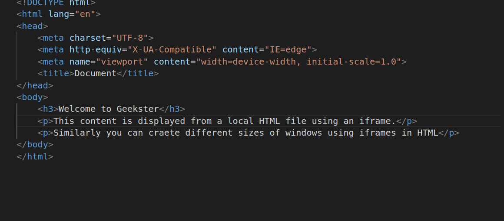

# iframes
1.
##### Explanation
* scrolling Attribute:
The scrolling attribute controls whether scrollbars are displayed within the iframe when the content inside it is larger than the iframe's dimensions. It can take one of three values:

   * "yes": Display both horizontal and vertical scrollbars.
   * "no": Do not display any scrollbars, even if the content is larger.
   * "auto": Display scrollbars only if the content overflows the iframe's dimensions.
* iframe is an inline elemnt that allows us to embed another document or webpage within the current document.

2.
##### Explanation
* h3 tag used for heading
* p tag is used for paragraph

* In this project I have created two files content.html and index.html
* In content.html i have created dome content to be displayed on frame in index.html
* In index.html I have created inner frame using iframe tag. In this i have created innerframes for youtube and geekster platform and also some content file 
